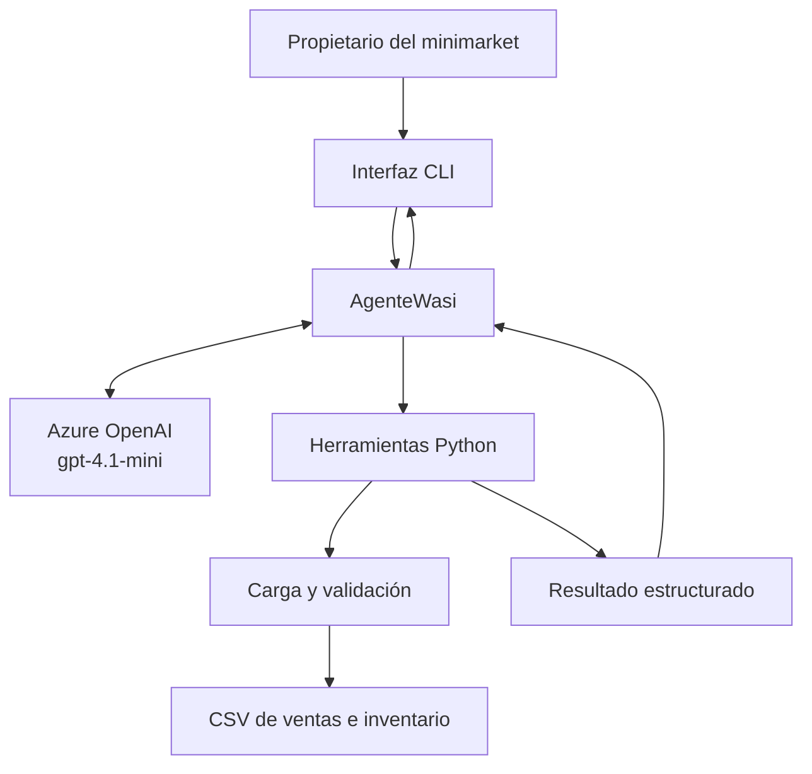

# Arquitectura de AgenteWasi

## Descripción general

AgenteWasi utiliza una arquitectura local con herramientas deterministas de Python y un modelo desplegado en Microsoft Foundry. El modelo interpreta la pregunta y selecciona una herramienta; los cálculos se realizan únicamente sobre los archivos CSV ficticios.

## Diagrama

## Componentes

| Componente | Responsabilidad |
|---|---|
| Usuario | Formula preguntas sobre ventas, inventario, productos y clientes ficticios |
| CLI | Recibe consultas, muestra ejemplos y permite finalizar la conversación |
| AgenteWasi | Mantiene el contexto y coordina el modelo con las herramientas |
| Azure OpenAI | Interpreta la consulta, selecciona herramientas y redacta respuestas |
| Herramientas Python | Ejecutan cálculos deterministas mediante pandas |
| Validadores | Controlan archivos, columnas, fechas, valores y referencias |
| Archivos CSV | Almacenan ventas e inventario ficticios sin información personal real |

## Flujo de una consulta

1. El propietario escribe una pregunta en la interfaz CLI.
2. AgenteWasi envía la consulta y las definiciones de herramientas al modelo.
3. El modelo selecciona una herramienta y genera sus argumentos.
4. Python carga y valida los archivos CSV.
5. La herramienta calcula un resultado estructurado.
6. El resultado vuelve al modelo.
7. El modelo redacta una respuesta clara en español.
8. La CLI muestra la respuesta al propietario.

## Manejo de errores

- Los archivos inexistentes o inválidos son rechazados con mensajes comprensibles.
- Las columnas faltantes se identifican explícitamente.
- Las consultas fuera de alcance se rechazan sin inventar información.
- Los errores de conexión con Azure se controlan sin cerrar inesperadamente la CLI.
- Las herramientas pueden probarse independientemente del servicio de inteligencia artificial.

## Seguridad

Las credenciales permanecen en `.env`, que no está versionado. Los datos son ficticios y las recomendaciones no modifican ventas, inventario ni pedidos.
